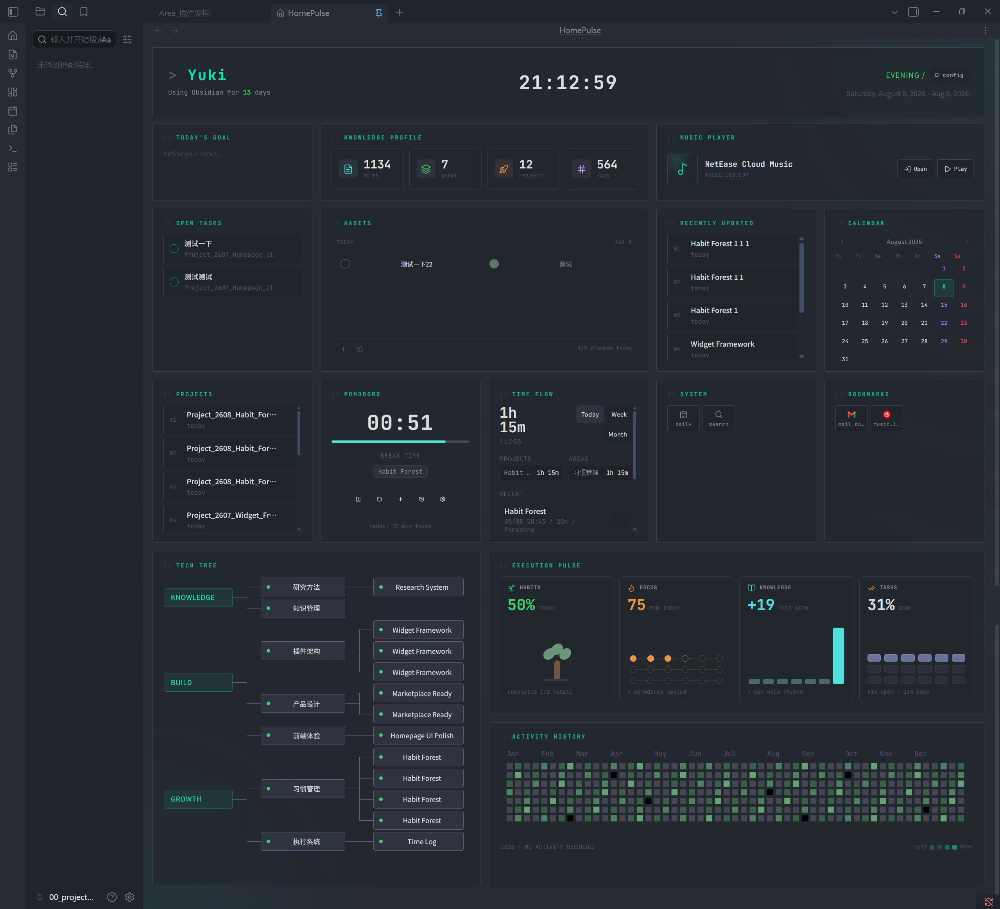

# Yuki Homepage

A local-first Obsidian homepage plugin that brings tasks, calendar, habits, pomodoro, activity heatmap, and a knowledge capability map into one cohesive dashboard. Built with a draggable grid layout and responsive compact reflow for both 14-inch laptops and widescreen displays.



## Features

- **Editable Grid Layout** — Drag, resize, and arrange widgets in a responsive 2-column grid. Compact-reflows for narrower viewports.
- **Homepage View** — Register a custom Obsidian view as your homepage. Pin it as a persistent tab and auto-open on startup.
- **First-Run Setup Wizard** — A guided 4-step wizard helps new users configure homepage name, project folder, area folder, and widget toggles on first launch.

## Widgets

| Widget | Description |
|---|---|
| **Focus** | Daily focus / intention with a simple input |
| **Projects** | Active projects from configured project folder, filtered by status/ing |
| **Tasks** | Aggregated tasks from vault markdown files |
| **Calendar** | Inline calendar view with daily navigation |
| **Habits** | Habit tracker with streak visualization |
| **Pomodoro** | Built-in pomodoro timer with work/break cycles |
| **Music Player** | Opens a configured NetEase Cloud Music page in the browser for login and playback |
| **Bookmarks** | Configurable URL bookmarks using `label|url` entries or direct URL lines |
| **System** | Configurable commands and daily-note shortcuts using `label|type|value` entries |
| **Activity History** | Activity heatmap from vault file modification timestamps |
| **Tech Tree** | Auto-generated capability map: Value → Area → Project, driven by Area metadata and project `area` frontmatter links |
| **Execution Overview** | Grouped Vault, Work, and Routine metrics |


## Plugin Dependencies

Yuki Homepage is self-contained and does not require any community plugin. Widget data is read directly from your local markdown files, including task checkboxes, frontmatter metadata, and file timestamps.

| Plugin | Requirement | When it is used |
|---|---|---|
| **Daily Notes** | Optional core plugin | Required only when a System item uses the `daily-note` action. Without it, only that button is unavailable. |
| **QuickAdd** | Optional community plugin | Required only when you configure a System command such as `quickadd:runQuickAdd`. It is not included in the public defaults. |
| **cMenu** | Not required | Yuki Homepage has no cMenu integration or dependency. |

Other community plugins, including Tasks and ActivityWatch-style plugins, are not required. Tasks are read from markdown checkboxes, while Activity History is generated from local file modification timestamps.

Bookmarks can optionally load native site favicons from each bookmark domain. This setting is disabled by default so the public default configuration remains local-first.

Music Player opens the configured music service URL in your browser. It does not store music account credentials or control playback inside your vault.

## Installation

### From Obsidian Community Plugins

1. Open Obsidian → Settings → Community Plugins
2. Search for "Yuki Homepage"
3. Install and enable

### Manual

Copy this directory into your vault:

`
.obsidian/plugins/yuki-homepage/
`

Then enable **Yuki Homepage** in Settings → Community Plugins.

## Configuration

Plugin settings allow you to customize:

- **Homepage Name** — The name displayed in the homepage header
- **Project Folder** — Where active projects live (default: 10_Projects)
- **Area Folder** — Where notes linked to Values with `value/*` tags live (default: `20_Areas`)
- **Tech Tree Source** — Source folder for capability map generation
- **Activity Source** — Source folder for activity history tracking
- **Music Player** — Browser URLs for music login and playback
- **Bookmarks** — Editable URL list in `label|url` format, or one URL per line
- **System Actions** — Editable action list in `label|type|value` format (commands and daily notes)
- **Widget Toggles** — Enable or disable individual widgets

### Tech Tree Metadata

Area notes are discovered from the configured Area folder. Every note with a `value/*` tag is included; `type: area` is optional:

```yaml
tags:
  - value/understanding-the-world
```

Projects link to Areas via frontmatter:

`yaml
area:
  - "[[20_Areas/Area_Learning|Learning]]"
tags: [type/project, status/ing]
`

Daily notes, task files, and single-output notes are excluded from the capability map.

## Development

`ash
npm install
npm run dev        # watch + dev build
npm run check      # type-check
npm run smoke      # smoke test
npm run build      # production build
`

## Privacy

- All data is stored and processed locally within your vault.
- The plugin makes no network requests and uploads no files.
- File scanning is limited to generating dashboard data (projects, tasks, capability map).
- data.json stores personal dashboard configuration, habit records, and vault paths — it is excluded from version control via .gitignore.
- Do not commit your plugin data, vault content, tokens, or secrets.
- Configure data source folders in plugin settings to restrict file scanning scope.

## Credits

- Visual design inspired by **Dashboard-Komorebi.css** (Komorebi / Catppuccin style) by **InlitX**. See [docs/UI-Credits.md](docs/UI-Credits.md) for full attribution.

## Roadmap

- [x] Grid layout with drag & resize
- [x] Widget system (Focus, Projects, Tasks, Calendar, Habits, Pomodoro, Music Player, Bookmarks, System, Activity History, Tech Tree, Execution Overview)
- [x] First-run setup wizard
- [x] TypeScript strict mode
- [x] GitHub Actions release workflow with artifact attestation
- [ ] More theme adaptations
- [ ] Widget configuration enhancements
- [ ] Community widget API

## License

MIT License. See [LICENSE](LICENSE).
