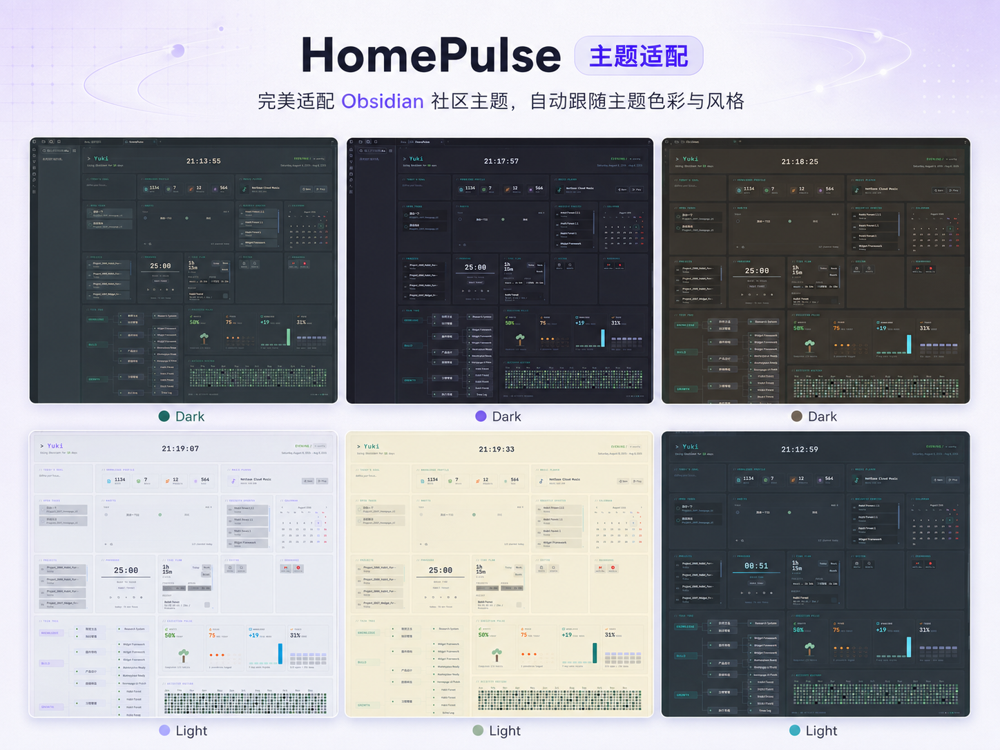

# HomePulse

<p align="center">
  <strong>中文</strong> · <a href="https://github.com/jukkau/HomePulse/blob/main/README.md">English</a>
</p>


**把你的 Obsidian 首页，变成一条「方向 → 行动 → 投入 → 积累 → 能力」的链路。**

HomePulse 帮你看见：**当前在推进什么、时间投向哪里、哪些项目和能力正在形成。**

连接笔记、任务、专注时间和能力地图，让每次打开 Obsidian 的第一眼，都落在真正重要的事情上。

## 主题适配

HomePulse 同时支持 Obsidian 的深色和浅色主题，会跟随主题背景、文字层级和强调色调整界面；也可以在设置中指定自定义强调色。下面的展示图包含多种深浅主题效果：



## 主要功能

- **首次设置向导**：首次启动时引导配置首页名称、项目目录、Area 目录和默认组件，几分钟就能用起来。
- **首页视图**：注册为独立 Obsidian View，可固定为首页标签页，并可在启动时自动打开。
- **本地优先**：核心数据来自本地 Markdown、frontmatter、任务 checkbox、文件修改时间和插件数据文件，不上传任何内容。
- **可编辑网格布局**：拖拽、调整大小和多列布局；屏幕较窄时自动压缩，编辑时保持当前布局列数。
- **中英文界面**：在 HomePulse 设置中切换 English / 简体中文，首页、组件、弹窗、设置页和首次设置向导会即时更新。
- **主题适配**：同时支持深色和浅色 Obsidian 主题，默认跟随主题背景和强调色，也支持自定义强调色。

首页编辑工具栏包含：

- **Header settings**：配置用户名、签名、首页锁定、Obsidian 使用起始日和主题强调色
- **Add widget**：添加组件
- **Manage layouts**：保存、加载和删除命名布局，并为每套布局设置列数，适合在不同设备或使用场景之间切换

## 组件

| 组件 | 说明 |
|---|---|
| **Today's goal** | 今日目标输入，一天的开头写一句想推进的事 |
| **Projects** | 从配置的文件夹、标签和文件名前缀中读取活跃项目 |
| **Tasks** | 汇总文件中的任务 checkbox |
| **Calendar** | 内置日历视图 |
| **Habits** | 习惯追踪与 streak 展示 |
| **Pomodoro** | 番茄钟计时，专注时间可归因到 Project、Area、Task Pool 或 Quick target，并写入本地 TimeLog |
| **Music Player** | 打开配置的音乐服务登录页或播放页 |
| **Bookmarks** | 支持 `label\|url` 或单行 URL 的快捷书签 |
| **System** | 支持命令和 Daily Note 等快捷动作 |
| **Activity History** | 基于 Vault 文件修改时间生成活跃热力图 |
| **Tech Tree** | 基于 Value → Area → Project 关系自动生成能力地图，无需额外维护元数据源文件 |
| **Execution Pulse** | 汇总习惯、Focus、知识增长和任务状态，反馈近期执行情况 |
| **Knowledge Profile** | 展示笔记、Area、项目和标签等知识资产概览 |
| **Recent Notes** | 展示最近更新的笔记 |

## 安装

### 从 Obsidian 社区插件安装

1. 打开 Obsidian → Settings → Community plugins
2. 搜索 **HomePulse**
3. 安装并启用

### 手动安装

将插件文件放入：

```text
.obsidian/plugins/homepulse/
```

然后在 Settings → Community plugins 中启用 **HomePulse**。

## 时间流

HomePulse 内置本地 TimeLog 记录层，不依赖外部服务。

- Pomodoro 完成的专注时间可以归因到 Project、Area、Task Pool 或 Quick target。
- 可以从 Pomodoro 组件手动补录时间。
- 可以查看和删除最近的 TimeLog 记录。
- 当存在 TimeLog 数据时，Execution Pulse 会优先使用时间聚合结果计算 Focus 指标。
- Activity History 只负责文件活跃热力图，不承担 TimeLog 管理入口。

## 依赖和隐私

HomePulse 不依赖其他 Obsidian 社区插件。Dashboard 数据主要来自本地 Markdown 文件、frontmatter、任务 checkbox 和文件修改时间。

| 插件 | 是否需要 | 使用场景 |
|---|---|---|
| **Daily Notes** | 可选核心插件 | 仅当 System 项使用 `daily-note` 动作时需要；未启用时只有该按钮不可用。 |
| **QuickAdd** | 可选社区插件 | 仅当 System 组件中的按钮配置为执行 QuickAdd 提供的命令时需要。 |
| **cMenu** | 不需要 | HomePulse 不依赖 cMenu。 |

## 配置

### 路径配置

首次设置向导中的 Project 文件夹和 Area 文件夹会作为全局默认值。

- Projects、Tasks、Knowledge Profile 和 Pomodoro 的项目目标在组件级文件夹留空时，会继承首次设置中的 Project 文件夹。
- Tech Tree 的 Area / Project 目录在组件级留空时，会继承全局 Area / Project 设置。
- 路径可以填写库内相对路径，例如 `Projects`，也可以填写指向当前 Vault 内部的绝对路径，例如 `D:/Vault/Projects`。
- Task Pool 文件同样支持库内相对路径或当前 Vault 内部的绝对文件路径。

### Tech Tree 元数据

Area notes 会从配置的 Area 文件夹中发现。带有 `value/*` 标签的笔记会被纳入能力地图，`type: area` 是可选项：

```yaml
tags:
  - value/understanding-the-world
```

Projects 通过 frontmatter 关联 Areas：

```yaml
area:
  - "[[20_Areas/Area_Learning|Learning]]"
tags: [type/project, status/ing]
```

Daily notes、任务文件和单输出笔记会从能力地图中排除。

### Time Flow 目标

- Project targets 来自项目笔记，并使用项目标题作为稳定 target id。
- 如果项目笔记在 frontmatter 中链接到 Area，时间记录可以聚合到该 Area。
- Area targets 来自 Area notes。
- Task Pool targets 指向一个配置的 Markdown 文件，用作松散任务池上下文，不追踪单个 checkbox。
- Quick targets 可直接输入，用于不属于已知 Project、Area 或 Task Pool 的时间记录。

## 开发

```bash
npm install
npm run dev        # watch + dev build
npm run check      # type-check
npm run smoke      # smoke test
npm run build      # production build
```

## 致谢

- 视觉设计参考了 **InlitX** 的 **Dashboard-Komorebi.css**（Komorebi / Catppuccin 风格）。完整说明见 [UI Credits](docs/UI-Credits.md)。

## 路线图

- [x] 支持可拖拽、可调整大小的网格布局
- [x] 完成组件体系（Focus、Projects、Tasks、Calendar、Habits、Pomodoro、Music Player、Bookmarks、System、Activity History、Tech Tree、Execution Pulse、Knowledge Profile、Recent Notes）
- [x] 完成首次设置向导
- [x] 完成 Time Flow MVP，支持 Pomodoro 归因、手动记录和本地日志删除
- [x] 支持自定义主题色
- [x] 支持 Obsidian 深色 / 浅色主题背景与强调色适配
- [x] 支持插件全界面的中英文切换，默认英文
- [ ] 增强 Widget 配置能力
- [ ] 基于聚合时间记录建设 Capability Growth

## License

MIT License. See [LICENSE](LICENSE).
